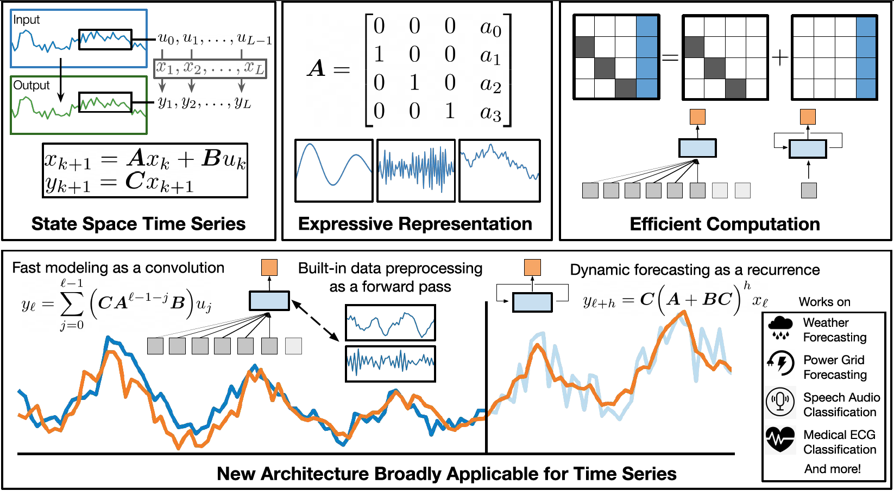
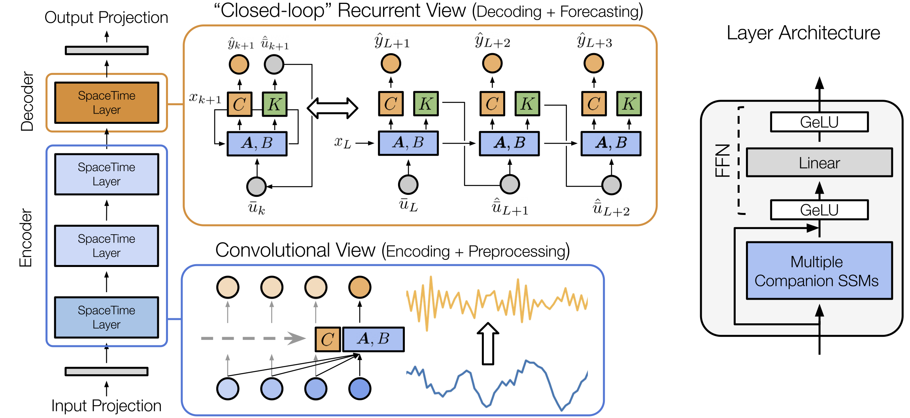

# SpaceTime 🌌⏱️

Code for SpaceTime, a neural net architecture for time series. Named after state-**space** models for **time** series forecasting and classification.

Cousin of S4, S4D, DSS, and H3. Descendent of LSSL. Expressive autoregressive modeling + fast flexible decoding (i.e., forecasting) ftw. 

Proposed in Effectively Modeling Time Series with Simple Discrete State Spaces, ICLR 2023. 




Paper links:     
* [ArXiv](https://arxiv.org/abs/2303.09489)   
* [OpenReview](https://openreview.net/forum?id=2EpjkjzdCAa)  


## Setup

### Dependencies  
A list of dependencies is provided in `environment.yaml`. We recommend creating a virtual environment with `conda`:  
```
conda env create -f environment.yaml
conda activate spacetime
```

### Data
Data for the Informer benchmark can be downloaded from [https://github.com/zhouhaoyi/ETDataset](https://github.com/zhouhaoyi/ETDataset). The data exists as CSV files, which should be saved in the directory `./dataloaders/data/informer/`, e.g.,   
```
./dataloaders/data/informer/etth/ETTh1.csv
./dataloaders/data/informer/etth/ETTh2.csv
./dataloaders/data/informer/ettm/ETTm1.csv
./dataloaders/data/informer/ettm/ETTm2.csv
```

## Usage

### Colab demo
We include an [example Colab notebook](https://colab.research.google.com/drive/1dyR7ZGnjNfS2GMjRUfDzujQLhxSo-Xsk?usp=sharing) walking through how to train and forecast a SpaceTime model on financial time series. For fun, we also provide a quick demo on how to power a trading bot with SpaceTime forecasts (probably with some bugs). Feel free to extend it and have fun. *None of this is financial advice!*

### Training scripts
Sample scripts for training models on the Informer benchmark are provided below. For a complete set of arguments, please see `./setup/args.py`. For an overview of key command-line arguments, please see the `Experiment arguments` section below.

```
# ETTh1 720  
python main.py --dataset etth1 --lag 336 --horizon 720 --embedding_config embedding/repeat --encoder_config encoder/default --decoder_config decoder/default --output_config output/default --n_blocks 1 --kernel_dim 64 --norm_order 1 --batch_size 50 --dropout 0.25 --lr 1e-3 --weight_decay 1e-4 --max_epochs 500 --early_stopping_epochs 20 --data_transform mean --loss informer_rmse --val_metric informer_rmse --criterion_weights 1 1 1 --seed 0 --no_wandb

# ETTh2 720   
python main.py --dataset etth2 --lag 336 --horizon 720 --embedding_config embedding/repeat --encoder_config encoder/default --decoder_config decoder/default --output_config output/default --n_blocks 1 --kernel_dim 64 --norm_order 1 --batch_size 50 --dropout 0.25 --lr 1e-3 --weight_decay 1e-4 --max_epochs 500 --early_stopping_epochs 20 --data_transform mean --loss informer_rmse --val_metric informer_rmse --criterion_weights 1 1 1 --seed 0 --no_wandb

# ETTm1 720  
python main.py --dataset ettm1 --lag 336 --horizon 720 --embedding_config embedding/repeat --encoder_config encoder/default --decoder_config decoder/default --output_config output/default --n_blocks 1 --kernel_dim 64 --norm_order 1 --batch_size 50 --dropout 0.25 --lr 1e-3 --weight_decay 1e-4 --max_epochs 500 --early_stopping_epochs 20 --data_transform mean --loss informer_rmse --val_metric informer_rmse --criterion_weights 1 1 1 --seed 0 --no_wandb

# ETTm2 720  
python main.py --dataset ettm2 --lag 336 --horizon 720 --embedding_config embedding/repeat --encoder_config encoder/default --decoder_config decoder/default --output_config output/default --n_blocks 1 --kernel_dim 64 --norm_order 1 --batch_size 50 --dropout 0.25 --lr 1e-3 --weight_decay 1e-4 --max_epochs 500 --early_stopping_epochs 20 --data_transform mean --loss informer_rmse --val_metric informer_rmse --criterion_weights 1 1 1 --seed 0 --no_wandb
```

## More details

### SpaceTime architecture and configs



To build a SpaceTime model, we specify a series of config files responsible for individual model components (determined via the config arguments, e.g., `--embedding_config embedding/<config_name>`). Default config files are located in `./configs/model`. Please find more information on the directory structure via the config paths and descriptions below.

| Config Path (`./configs/model/`) | Description |
|---|---|
| `embedding/` | Configs for the input layer, which maps from the input sample dimension (1 for univariate data) to the model dimension (hidden-layer width). |
| `encoder/` | Configs for the encoder blocks ("SpaceTime layers" in the paper).  - Each config specifies the configs behind the preprocessing, open-loop, and closed-loop SSMs, the MLPs, and the skip connections in each block. |
| `decoder/` | Configs for the decoder block. Same organization as `encoder/` |
| `ssm/` | Configs for open-loop (convolutional view) SSMs used in the encoder blocks.  - Also contains subdirectories for preprocessing and closed-loop SSMs. |
| `ssm/preprocess/` | Configs for the preprocessing SSMs (e.g., differencing, moving average residual) used in the encoder blocks.  |
| `ssm/closed_loop/` | Configs for the closed-loop (recurrent view) SSMs used in the decoder block. |
| `mlp/` | Configs for MLPs (FFNs) used in each block. |
| `output/` | Configs for the output layer, which maps from the model dimension to the target dimension. |


### Command-line arguments

| Argument | Description |
|---|---|
| --dataset | The dataset name |
| --lag | Input sequence length, i.e., number of historical time-steps or lag terms taken as input to the model |
| --horizon | Output sequence length, i.e., number of future time-steps or horizon terms to predict |
| --embedding_config | Config file for model embedding layer |
| --encoder_config | Config file for model encoder blocks ("SpaceTime Layers" in the paper) |
| --decoder_config | Config file for model decoder blocks ("SpaceTime Layers" in the paper) |
| --output_config | Config file for model output layer |
| --n_blocks | Number of blocks (SpaceTime layers) in the model encoder. Overrides default specified in `--encoder_config` file |
| --kernel_dim | Dimension of SSM kernel used in each block. Overrides default specified in SSM config file (see section on SpaceTime Architecture for more details) |
| --norm_order | Normalization order applied to `A`, `B` and `C` / `K` matrices when computing SSM outputs |
| --early_stopping_epochs | Number of epochs to wait before early stopping. Training stops after validation metric (specified in `--val_metric`) does not improve after this many epochs. |
| --data_transform | Transformation applied to lag terms before being used as model inputs. We reverse this transformation for the predictions. Defaults to subtracting the mean over inputs. |
| --criterion_weights | List of 3 values that specify relative weight of loss components. Given `--criterion_weights w0 w1 w2`, `w0` weights loss over horizon term model outputs,  `w1` weights loss over lag term model outputs, `w2` weights loss over lag term closed-loop outputs (last-layer next-time-step inputs).  Please see `./train/step/informer.py` for additional details. |
| --no_wandb | If included, does not use [Weights & Biases](https://wandb.ai/site) (wandb) to log experiment metrics (default logs to wandb) |
| --no_cuda | If included, does not use GPU for training and inference (default uses one GPU if available) |


## Citation

If you use our code or found our work valuable, please cite:

```
@article{,
  title={Effectively Modeling Time Series with Simple Discrete State Spaces},
  author={Zhang, Michael, and Saab, Khaled and Poli, Michael and Dao, Tri and Goel, Karan and R{\'e}, Christopher},
  journal={International Conference on Learning Representations},
  year={2023},
}
```
